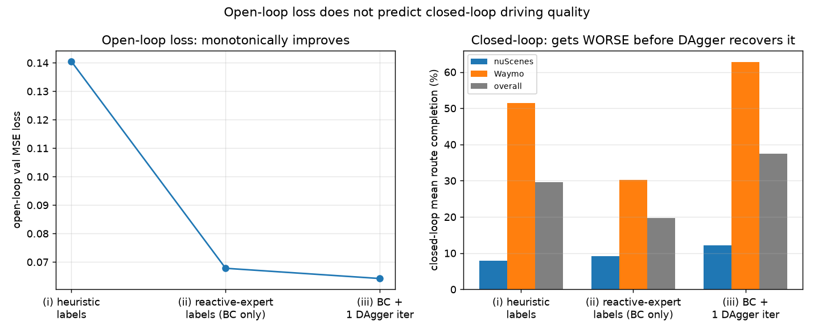
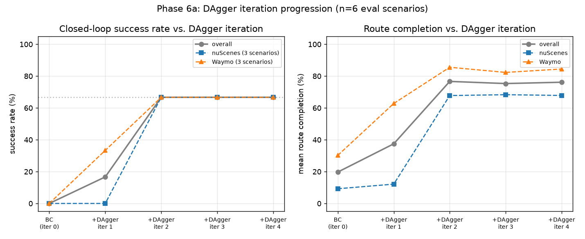

# Closed-Loop Imitation-Learning Planner on Real-World Driving Scenarios

An end-to-end driving policy trained by imitation on **reconstructed nuScenes & Waymo scenarios**,
evaluated *closed-loop* — the policy actually drives, it isn't just scored on one-step predictions.


*Same held-out Waymo scene, same start state. Left: plain behavior cloning. Right: after DAgger,
the policy navigates through dense traffic and completes the route (95.8% route completion).
In both panels the **teal/green trail is the ego vehicle's path** — the car being controlled by
the learned policy. Surrounding vehicles replay their logged trajectories.*

## How it works

This section walks through every component of the pipeline in the order they connect.

---

### Step 1 — The simulator

[MetaDrive](https://github.com/metadriverse/metadrive) and
[ScenarioNet](https://github.com/metadriverse/scenarionet) are used together to reconstruct
real-world logged drives as **closed-loop interactive simulations** — digital twins.

A real nuScenes or Waymo drive is a time-stamped recording of every vehicle's position and heading
at 10 Hz. ScenarioNet converts these logs into a format MetaDrive can replay: the road geometry is
reconstructed from the log, and all surrounding vehicles (pedestrians, cyclists) are replayed
frame-by-frame from the recorded positions, as if they had been teleported along their original
paths.

The result is a simulation that looks and feels like a real traffic scene: real intersection
layouts, real agent behaviors, no synthetic procedural generation. No perception stack and no
render farm are needed — the top-down renderer runs on CPU.

The **ego vehicle** (the car being controlled by the learned policy) is placed at the logged start
state. The simulator then steps forward at 10 Hz: at each step, the policy receives an observation
and outputs a steering and throttle/brake action, which drives the ego through a standard vehicle
physics model. Everything else in the scene follows its logged trajectory regardless of what the
ego does.

---

### Step 2 — Observation and action

The policy receives MetaDrive's default **`LidarStateObservation`** at each timestep: a 161-dimensional
vector containing

- Ego kinematics: heading difference to the current lane, speed, steering, last actions, yaw rate
- Road geometry: distances to lane boundaries (or lidar-scan cloud points against lane lines)
- Navigation: projections of the upcoming waypoints — how far and in which direction
- Nearby traffic: relative positions and speeds of the 4 closest vehicles (from a 120-ray lidar)

This is a **compact state vector**, not an image. The policy outputs a 2-dimensional continuous
action `[steering, throttle/brake]`, each normalised to the range `[-1, 1]`, which is fed directly
into MetaDrive's vehicle physics.

---

### Step 3 — The data problem: no control channel in the logs

The natural approach for behavior cloning would be: replay the log, record what the human driver
did, train the policy to imitate it.

The problem is that nuScenes and Waymo logs **do not record a control channel** — there is no
logged steering angle or throttle value. The logs only record position, heading, and velocity at
each timestep. MetaDrive's `ReplayEgoCarPolicy` handles this by teleporting the ego directly to
the logged pose at each step, bypassing vehicle physics entirely.

This means there is no "action the human took" to imitate. The policy needs to output actions that
drive through **real physics** — but the log only tells us where the human ended up, not what
control inputs produced it.

An initial attempt derived pseudo-actions from the log by inverting a kinematic bicycle model
(steering from path curvature) and using a heuristic normalization for throttle. A per-dimension
validation-loss check revealed the problem: while the model learned to predict steering reasonably
well, it **never meaningfully learned throttle** — the heuristic labels were too noisy to be
learnable. Replaying those "ground truth" labels through the real physics confirmed the issue: the
labels themselves only completed 49.9% of the route on average, with several ending in collision.
The label quality was the bottleneck, not the model.

---

### Step 4 — The reactive tracking-controller expert

The fix is a **reactive tracking-controller expert** implemented in `src/data/tracking_expert.py`.
Instead of deriving actions after the fact from the log, the expert *drives the car in real time*
and reacts to the vehicle's actual state at every step:

- **Steering (pure pursuit):** at each step, find the point on the logged reference path that is
  a lookahead distance ahead of the current ego position (`lookahead = 5 m + 0.5 × speed`).
  Compute the bearing from the ego to that point, convert to a steering angle via the bicycle
  model (`arctan(wheelbase × curvature)`), and normalise by the maximum steering angle.
- **Throttle/brake (PID):** track a target speed derived from the logged velocity profile at the
  current route progress. A proportional–integral–derivative controller computes a
  throttle/brake value based on the error between current speed and target speed.

Because this controller is a function of the ego's *current* state — not a lookup into the
original log — it produces a physically consistent action at any position and heading the car
actually reaches, **including states far off the logged path**. This queryability is the property
that makes DAgger possible.

**Expert quality check:** before using this controller as a teacher, it is run on its own through
the real physics simulator on the training scenarios — the controller directly drives the ego, with
no learned policy involved. It achieves **95%+ route completion on 5 of 6 training scenarios**.
This confirms the expert itself is capable of following the logged routes through real physics,
which is the minimum requirement for it to be a useful teacher. (The remaining 1 scenario is the
known degenerate near-stationary clip where the route length is essentially zero.)
This number is **not** the trained policy's performance — the policy will be evaluated separately
in Step 7, after it has learned to imitate this expert.

---

### Step 5 — Expert data collection (behavior cloning dataset)

With the reactive expert in place, the BC dataset is collected by rolling out the **expert** on
the training scenarios (`src/data/collect_expert.py`):

1. Reset the environment at the logged start state (training scenarios only; held-out eval
   scenarios are never touched).
2. At each timestep, the reactive expert queries the current ego position, heading, and speed,
   and returns `[steering, throttle/brake]`. The environment steps forward under this action —
   real physics, not teleportation.
3. Record the tuple `(observation, expert_action)` for each step.
4. Repeat until the episode ends (route complete or time limit).

The result is `data/bc_dataset.npz`: ~860 `(obs, action)` pairs across 6 training scenarios,
where every action was generated by the same physics interface that the trained policy will use
at eval time.

---

### Step 6 — Behavior cloning training

`src/train/train_bc.py` trains a small MLP (`src/models/mlp_policy.py`) by minimising MSE
between the policy's predicted action and the expert's action:

- **Architecture:** `[161 → 128 → 64 → 2]`, ReLU activations, `tanh` output (keeping
  predictions in `[-1, 1]`).
- **Training:** Adam optimiser, weight decay `1e-4`, early stopping on validation MSE
  (patience 10 epochs), `torch.cuda.amp` AMP for efficiency.
- **Dataset split:** 90 / 10 random split by transition (fixed seed for reproducibility).
- **Peak VRAM:** ~18 MiB.

The best-validation checkpoint is saved to `outputs/bc_best.pt`, together with the full
configuration, so evaluation is always tied to a specific training run.

---

### Step 7 — Closed-loop evaluation

Validation MSE on held-out transitions is **not** the primary metric. The policy is evaluated by
**actually driving** (`src/eval/closed_loop_eval.py`):

1. Load `outputs/bc_best.pt` and the **held-out** eval scenarios (never seen during training or
   expert data collection; `configs/default.yaml` records the exact split).
2. Reset the environment at the logged start state of each eval scenario.
3. At every timestep, run the policy forward (`model(obs)`) and pass the action to the simulator.
   The ego drives through real physics.
4. Run until the episode terminates: route complete (`arrive_dest`), off-road, collision, or
   timeout.
5. Record per-scenario: success, collision, off-road, route-completion fraction, and lateral
   deviation from the logged reference path.

Metrics are reported separately for nuScenes and Waymo scenarios (the two datasets have different
geometry, so aggregate numbers can be misleading).

The results after plain BC (Stage ii) showed 0% success across all 6 held-out scenarios and
100% off-road rate — despite a reasonable open-loop validation MSE of 0.068.

---

### Step 8 — Diagnosing the gap: covariate shift

Two diagnostics pinpointed the mechanism behind the BC failure:

**Lateral drift** (`outputs/lateral_drift.png`): during closed-loop rollouts, the ego's lateral
offset from the logged reference path was recorded at every step. Every scenario showed a
**smooth, monotonically increasing** lateral offset — the ego drifted steadily toward the road
edge over tens of steps. This is the fingerprint of compounding steering error: small per-step
mistakes accumulate because the policy has never been trained on the states it reaches when those
mistakes compound.

**Action gap** (`outputs/action_gap.png`): the ego was driven by the BC policy on the *training*
scenarios, and at each step the reactive expert was queried for the action *it* would take from
the policy's actual current state. The gap `|expert_action − policy_action|` **grew steadily
over the rollout**, reaching large values just before the ego left the road. This confirms that
the policy's corrective output diverges from the expert's exactly where correction matters most
— and that the expert *could* correct the situation, if it were being listened to.

The combined evidence identifies the failure as **covariate shift**: the policy learned from
states along the expert's trajectory, but once it reached states slightly off that trajectory
(from small per-step errors), it had no reliable behaviour, and the errors compounded.

---

### Step 9 — DAgger: closing the gap

DAgger (*Dataset Aggregation*) is the direct algorithmic response to covariate shift in imitation
learning. See the [DAgger appendix](#appendix--dagger-in-depth) for the full theory, algorithm,
and the reason this project's expert design was a prerequisite for DAgger to be applicable at all.

Each iteration (`src/data/collect_dagger.py` → `src/train/run_dagger_iterations.py`):

1. **Roll out the current policy** under real physics on the training scenarios. Wherever the
   policy ends up — including near-boundary states where BC was unreliable — is where the expert
   will be queried.
2. **Query the reactive expert** at every visited state. Because the expert is a controller (not
   a log replay), it returns a meaningful action at any vehicle state.
3. **Aggregate**: combine the new `(visited_state, expert_action)` pairs with all prior data
   (`D_BC ∪ D_DAgger_1 ∪ …`).
4. **Retrain** the same MLP on the full aggregate.
5. **Evaluate** on the held-out eval set.

The result after four iterations: success climbed from 0% → 17% → **67%** and then plateaued.
The plateau is evidence in itself: iterations 3 and 4 added ~1,750 more transitions but metrics
did not improve, confirming **distribution coverage** — not data volume — was the binding
constraint.

---

## Results

All metrics are measured on **6 held-out scenarios** (3 nuScenes + 3 Waymo) that were never
used for training or DAgger data collection. "Success" means the ego vehicle completed at least
95% of its logged reference route without leaving the road. "Route completion" is the mean
fraction of the route reached before the episode ended.

The full progression — from the initial broken labels through to four DAgger iterations — is
shown in one table. The open-loop validation MSE (how well the model fits the training data) is
shown alongside the closed-loop result (how well the policy actually drives) to make the
disconnect between the two visible.

| pipeline stage | steps | open-loop val MSE | success (6 scenarios) | route completion |
|---|---|---|---|---|
| (i) Heuristic labels, BC | Steps 1–3 | 0.1405 | 0 / 6 — 0% | 29.7% |
| (ii) Reactive-expert labels, BC — baseline | Steps 4–7 | 0.0678 | 0 / 6 — 0% | 19.7% |
| (iii) + DAgger iteration 1 | Step 9 ×1 | 0.0642 | 1 / 6 — 16.7% | 37.5% |
| (iv) + DAgger iteration 2 | Step 9 ×2 | — | **4 / 6 — 66.7%** | **76.7%** |
| (v) + DAgger iteration 3 | Step 9 ×3 | — | 4 / 6 — 66.7% | 75.3% |
| (vi) + DAgger iteration 4 | Step 9 ×4 | — | 4 / 6 — 66.7% | 76.1% |

A few things worth reading in this table:

- **Open-loop loss (column 3) keeps improving** across all stages — but closed-loop success
  (column 4) does not track it. Stage (ii) has a lower loss than stage (i) yet *worse* closed-loop
  performance. This is the central finding, shown in the figure below.
- **DAgger iteration 1 produces only 1 success out of 6.** The big jump — from 1/6 to 4/6 —
  happens at iteration 2. One iteration is not enough; the distribution gap needs more coverage.
- **Iterations 3 and 4 add ~1,750 more transitions but the success count stays at 4/6.** The
  plateau shows the remaining limit is scenario geometry (the one persistently failing scenario,
  `nuscenes:6`, is an intersection outside the training set's coverage), not the amount of
  DAgger data.



*Open-loop validation loss improves at every stage. Closed-loop route completion does not — it
drops after the label fix (stage ii) then climbs as DAgger iterations add coverage of the states
the policy actually visits during deployment.*




*nuScenes scenario 7. Left: behavior cloning baseline (stage ii). Right: after 4 DAgger
iterations (stage vi) — the policy completes the route at 95.3%. The **teal/green trail tracks
the ego vehicle's driven path** in real time; surrounding vehicles (random colors) replay their
logged trajectories.*

---

## Reading the visualisations

In every top-down GIF and figure in this repo:

- **The ego vehicle** (the car driven by the policy) is identified by a **teal/green trail**
  marking its path. The camera follows and centers on the ego, which always faces upward in
  frame. The leading edge of the teal trail is where the ego currently is.
- **Surrounding vehicles** replay their logged real-world trajectories and are rendered in
  randomly assigned colors (orange, blue, pink, etc.). They are not controlled by the policy.

---

## Reproduce

```bash
# Environment (conda; Python 3.11, CUDA 12.x wheel)
conda create -n e2ecl python=3.11 -y
conda activate e2ecl
bash scripts/setup_env.sh          # installs MetaDrive + ScenarioNet (source) + torch

# Sanity check: render a real reconstructed scenario
python metadrive/examples/drive_in_real_env.py --top_down

# 1. Collect physics-consistent expert data (reactive tracking controller)
python -m src.data.collect_expert

# 2. Train the base behavior-cloning policy
python -m src.train.train_bc

# 3. Closed-loop evaluation (per-dataset metrics + rollout GIFs)
python -m src.eval.closed_loop_eval

# 4. DAgger iterations (runs 3 iterations by default, starting from bc_best.pt)
python -m src.train.run_dagger_iterations
```

> All splits are deterministic and set in `configs/default.yaml` — the eval scenarios are never
> used for training or DAgger collection.

## Repo layout

```
src/env/make_env.py                  # ScenarioEnv wrappers (train / eval / collect)
src/data/tracking_expert.py          # pure-pursuit + PID reactive expert (queryable)
src/data/collect_expert.py           # roll out expert → (obs, action) dataset
src/data/collect_dagger.py           # roll out policy → (obs, expert-action) DAgger dataset
src/models/mlp_policy.py             # the policy network
src/train/train_bc.py                # behavior cloning
src/train/run_dagger_iterations.py   # DAgger aggregation loop
src/eval/closed_loop_eval.py         # closed-loop metrics, per dataset
src/eval/record_video.py             # rollout GIFs (tight ego-tracked camera)
src/utils/metrics.py                 # success / off-road / route completion / deviation
src/utils/viz.py                     # headline figure and diagnostic plots
configs/default.yaml                 # splits, model, hyperparameters
docs/architecture.md                 # full method notes, diagnostics, and analysis
```

## Honest limitations

This is a **methodology demonstrator, not a benchmark result**:

- **Small evaluation set (n = 6).** "67% success" is 4 of 6 scenarios. The numbers show *trends*,
  not statistically separable effects; no error bars are claimed.
- **Trained on nuScenes only (~5 usable scenarios).** Waymo scenarios are both held-out *and*
  out-of-domain. Route-completion also depends on scenario geometry (straighter clips score
  higher), so per-scenario context matters more than the aggregate.
- One scenario (`nuscenes:6`) does not converge across any iteration and is included in the
  evaluation, not filtered.
- The early throttle labels were physically wrong (a heuristic, not a dynamics inversion);
  diagnosing and replacing them is half the story.

## What I'd do next

- **More training data / a second training source** — add Waymo to *training*, or convert more
  scenarios via ScenarioNet, to test whether in-domain performance is data-bound.
- **RL fine-tuning** (PPO) initialised from the DAgger policy — a different paradigm, kept out of
  this project on purpose to preserve the single, clean imitation-learning story.
- **BEV-raster + CNN** input for a more AD-native representation.

## Why closed-loop (context)

Modern autonomous-driving research has moved toward end-to-end policies (the UniAD / VAD line) and
toward **closed-loop** evaluation (nuPlan, CARLA Leaderboard, Bench2Drive), because open-loop
prediction error is known not to predict actual driving quality. A policy that imitates well for
one step still drifts off-distribution over a full rollout. This project is a self-contained
demonstration of exactly that phenomenon, and of the canonical imitation-learning response to it.

## References

- **DAgger:** Ross, S., Gordon, G. J., & Bagnell, J. A. (2011). A Reduction of Imitation Learning
  and Structured Prediction to No-Regret Online Learning. *Proceedings of the 14th International
  Conference on Artificial Intelligence and Statistics (AISTATS), 2011. PMLR vol. 15, pp. 627–635.*
  [[arXiv:1011.0686]](https://arxiv.org/abs/1011.0686)
- **MetaDrive:** Li, Q., et al. (2022). MetaDrive: Composing Diverse Driving Scenarios for
  Generalizable Reinforcement Learning. *IEEE TPAMI*.
  [[GitHub]](https://github.com/metadriverse/metadrive)
- **ScenarioNet:** Li, Q., et al. (2023). ScenarioNet: Open-Source Platform for Large-Scale
  Traffic Scenario Simulation and Modeling.
  [[GitHub]](https://github.com/metadriverse/scenarionet)

## Acknowledgements

Built on [MetaDrive](https://github.com/metadriverse/metadrive) and
[ScenarioNet](https://github.com/metadriverse/scenarionet); scenarios from the bundled nuScenes
and Waymo Open Motion mini splits.

---

## Appendix — DAgger in depth

### What DAgger is

**DAgger** (*Dataset Aggregation*) is a foundational imitation-learning algorithm introduced by
Ross, Gordon, and Bagnell in 2011:

> Stéphane Ross, Geoffrey J. Gordon, and J. Andrew Bagnell. "A Reduction of Imitation Learning
> and Structured Prediction to No-Regret Online Learning." *Proceedings of the 14th International
> Conference on Artificial Intelligence and Statistics (AISTATS), 2011. PMLR vol. 15, pp. 627–635.*
> [[arXiv:1011.0686]](https://arxiv.org/abs/1011.0686)

### The problem it solves: compounding error in behavior cloning

Plain behavior cloning (BC) trains on the expert's state distribution, but at test time the
policy visits its own state distribution. Any small per-step error moves the policy into states
the expert never demonstrated. The policy then behaves worse at those unseen states, producing
larger errors, which compound — this is the lateral drift you see in `outputs/lateral_drift.png`.

Ross & Bagnell formalised this precisely: in the worst case, BC's total error over an episode of
length *T* grows as **O(T² ε)** (quadratic in the horizon, where ε is the per-step imitation
error). DAgger reduces that to **O(T ε)** — linear — by ensuring the training distribution
matches the policy's actual deployment distribution. That quadratic-to-linear reduction is the
core theoretical contribution of the paper.

### The algorithm

```
1. Collect demonstrations from the expert → initial dataset D.
2. Train policy π on D (ordinary behavior cloning for iteration 1).
3. For each subsequent iteration:
     a. Run policy π in the environment; record every state visited.
     b. Query the expert for the correct action at each visited state.
     c. Add those (visited-state, expert-action) pairs to D.
     d. Retrain π on the full aggregated D.
```

The original paper mixes the expert and the current policy during rollouts with a probability β
that decays across iterations (β = 1 in iteration 1, reducing toward 0). In this project,
iteration 1 was pure BC, and from iteration 2 onward the policy drove exclusively — this is the
common simplified variant. A reader familiar with the original should know the exact mixing
schedule was not used.

### Why DAgger required the expert redesign in this project

The key requirement of DAgger is an **interactive, queryable expert**: something you can ask
"what would you do in this exact state?" for *arbitrary* states the learner stumbles into, not
only states drawn from a fixed demonstration dataset.

The original "expert" used in Phase 2 of this project was `MetaDrive`'s `ReplayEgoCarPolicy` —
it teleports the ego along the logged trajectory at each step, bypassing physics entirely. That
policy is only defined *along the logged path*. It cannot be queried at a state 2 metres to the
left of the log, or at a different speed. Running DAgger on top of it would be meaningless: the
"expert" would have no valid answer for the states the policy actually visits when it drifts.

The reactive **pure-pursuit + PID tracking controller** (`src/data/tracking_expert.py`) solves
this: it is a function of the vehicle's *current* state (position, heading, speed) and returns a
steering and throttle action from anywhere. It does not care whether the vehicle is on or off the
logged path. This is precisely what makes DAgger applicable — the label fix in the middle of the
project was not just a bug fix on the quality of BC data; it was the prerequisite that made the
DAgger step possible at all.

### What the plateau means

After iteration 2, success rate stabilised at 66.7% despite adding ~1,750 more DAgger transitions
in iterations 3 and 4. The plateau is informative: if the limit were data volume, more transitions
would have continued to help. The fact that they did not indicates the remaining failures are due
to **distribution coverage** — specifically, one scenario (`nuscenes:6`) involves a geometry
(tight urban intersection) that the ~5 training scenarios never adequately represent, so no amount
of DAgger transitions from those same training scenarios will cover it. The fix would be more
diverse training scenarios, not more iterations on the existing ones.
